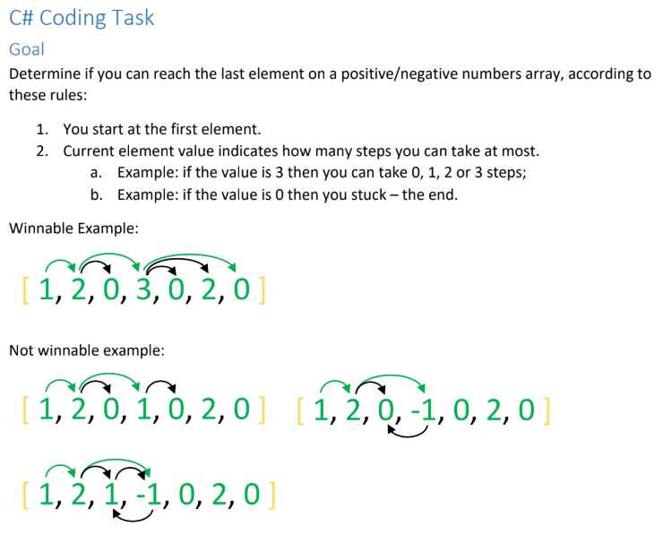
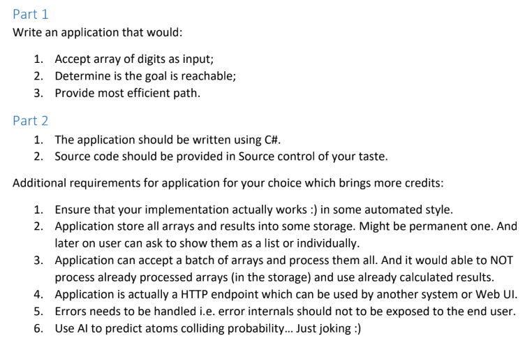
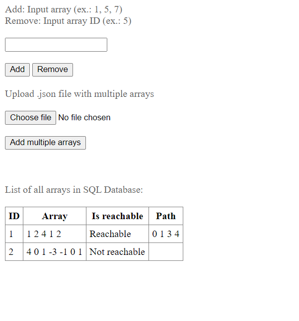
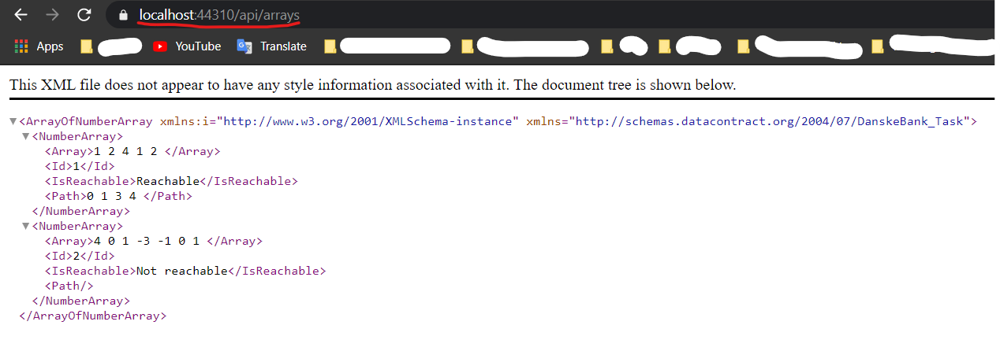
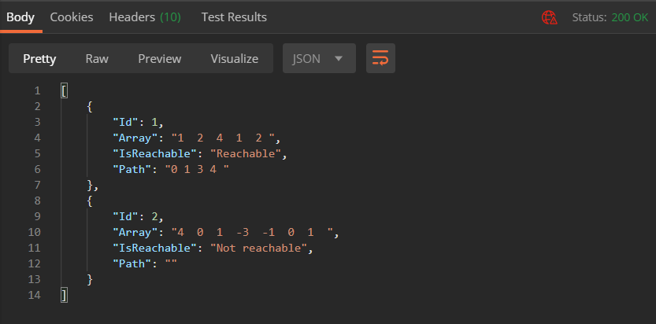
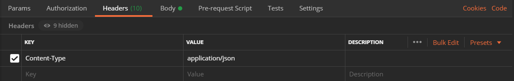
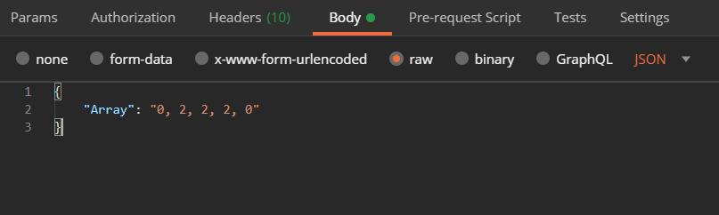

# DanskeBank Task Documentation

## Task

I have chosen **task #3**. This is what it looks like: 



---

## Task Objectives

**Task objectives** were challenging because some of them I did for the first time.



In additional requirements section I tried to implement every single one, but I was disappointed by myself because I wasn't able to succeed in doing **requirement #6**. Maybe next time!

---

## Coding Task Solution

I managed to solve this coding task by using **recursion**.
Code is pretty messy, but from my point of view every on array function should give correct answer.

**Solution:** 
* Beggining from the first digit, other one will be max distance number *(if number index is 0 and number is 3, then next number index will be 0 + 3 = 3, if it is not correct then other index is going to be 2 and so on)* and here is where recursive call to other number happens. 

* Before recursive call I save that number's jump to other index in a list *(if i jumped from index 0 to 2 then numberPaths[0] will contain 2)*, by that I will know in which indexes it was for avoiding endless loops. 

* Also, I check if this index is furthest index for winning condition of reaching last index and I save this index in path list for getting the most effective path *(it is filtered at the end of this algorithm)*.

My solution is stored in `"Action_Classes/ArraySolver.cs"` class

---

## Coding Task Solution Unit Tests

I did some **unit tests** only for coding task solution method. I was using **nUnit** testing framework.

Tests are in `DanskeBank Task.Tests` folder.

---

## Instructions on launching application

My application is created on **Web API** template, but I use **Web Form** for launching application.

* **Download/clone** this repository and launch .sln file in Visual Studio.

* Every time whenever you want to start my application, **one time click / highlight** `Main.aspx` file in Solution Explorer window and then debug application pressing on big green **IIS Express** button on upper menu.

---

## Project Description

I store all arrays, their results and if arrays are winnable then I store their paths as well in **SQL Local Database** named `Arrays.mdf` in `App_Data` folder.

For the first launch application should look like this:



### Adding an array

* To add an array to a database, input correct array in upper textbox (ex.: 1, 5, 7) and press **Add** button.

### Deleting an array

* To delete an array from a database, input only ID of the array in upper textbox (ex.: 5) and press **Remove** button.

### Adding multiple arrays
 
* To add multiple arrays to a database, choose file (only **.json**) and press **Add multiple arrays** button.

JSON file format should look like this:

```JSON
[
  "1, 2, 0, 18, 1, 2, 6, 7",
  "9, 5, 7",
  "4, 0, 0, 1, 0, 1"
]
```

I have an example **.json** file in folder `JSON_files` named `MultipleArrays_1.json`

---

## HTTP Requests

I have created 4 different HTTP routes in this application:

1.  GET `/api/arrays`
1.  GET `/api/arrays/id`
1.  POST `/api/arrays`
1.  DELETE `/api/arrays/id`

Example of **GET request 1.:**




> Link in photo: `https://localhost:44310/api/arrays`

Example of **GET request 1.** in **Postman:**


---

To test HTTP requests, launch an application with software like **Postman** for checking these 4 routes and how they affect database.

**IMPORTANT!**

For checking POST request in **Postman** *(or other software)* add header:
* **Content-Type** with value of **application/json**



* Body of input should look like this:

```JSON
{
    "Array": "0, 2, 2, 2, 0"
}
```



---

## Conclusion

Project was fun to do. In my opinion it is a good experience trying to figure out these kind of solutions.

**P.S.** Sorry for messy code, I was in a hurry writing it.